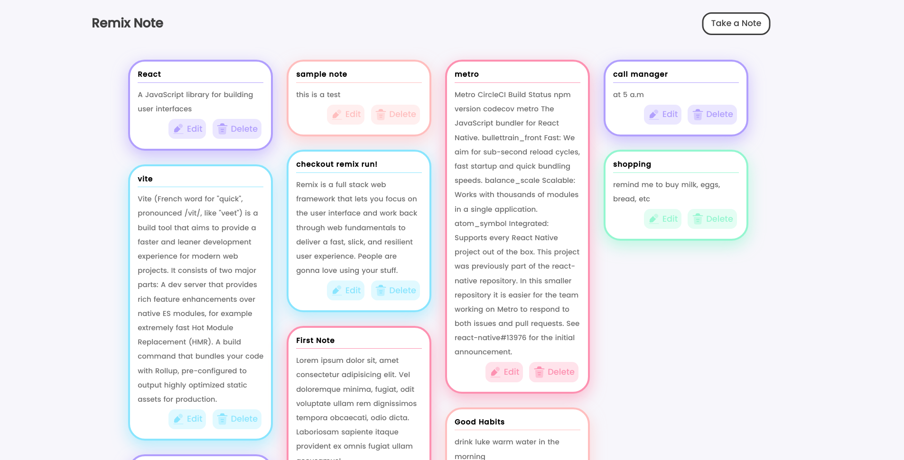
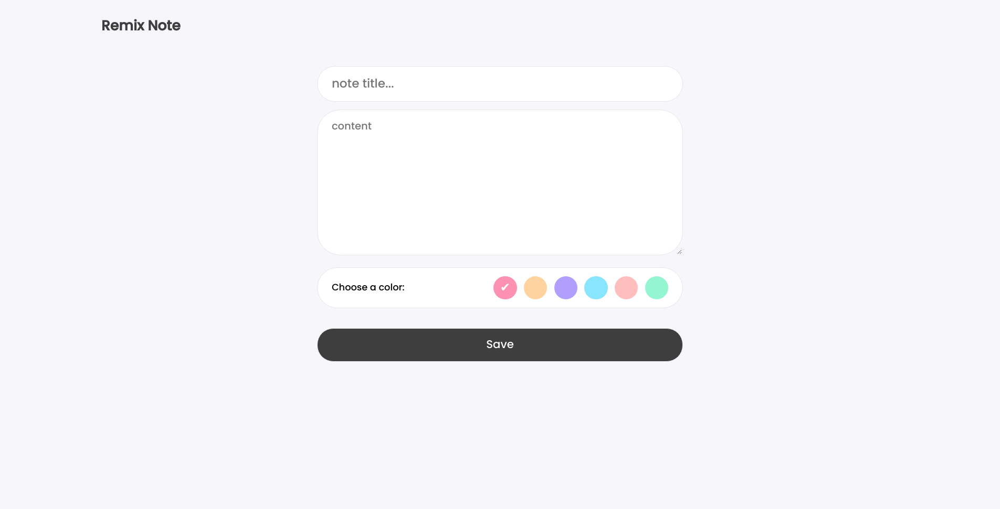

<h1 align="center">Remix Note ✏️</h1>

simple local note taking app which covers a lots of great Remix features

## Technologies

- Remix
- styled-components
- redis
- typescript

## Setting up development environment 🛠

1. clone the project and cd into folder

2. type `npm install` or `yarn install`

3. setup your redis server

4. rename `.env.example` to `.env` and then replace "REDIS_SERVER" with the redis Server URL

5. type `npm run start` or `yarn start` for development

6. type `npm run build` or `yarn build` for production

## License

[MIT](https://opensource.org/licenses/MIT)
